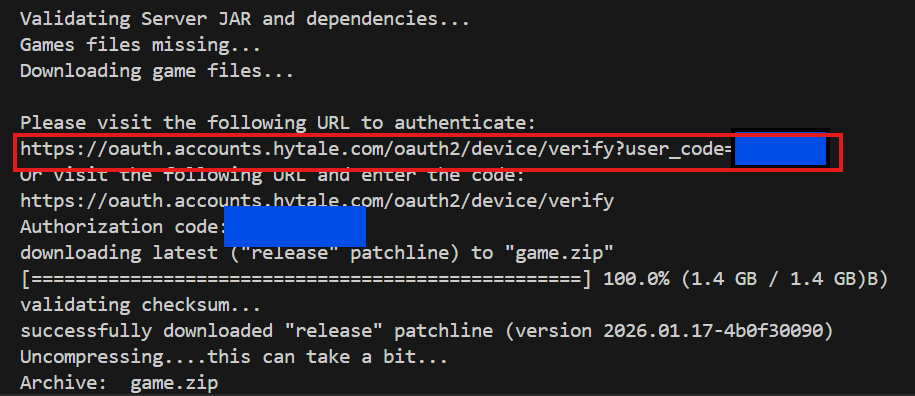
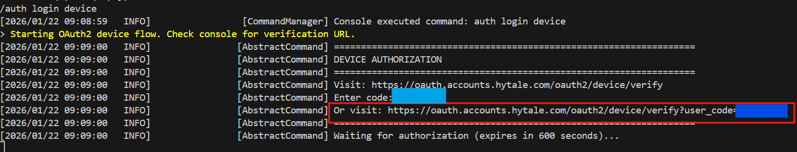

# hytale-docker-server

this image supports setting configuration through environment variables listed below.

# Build From Repo

Install Docker from https://docs.docker.com/engine/install/

clone repo 

```git clone https://github.com/ak474000/hytale-docker-server.git```

ensure your working directory is within the cloned folder

run

```docker build -t amk/hytale-server .``` *the Compose is setup to use this tag name. If you change the tag name to something else you need the change the 'image:' declaration within the compose to match.*

you should now be able to initialize the container through compose

```docker compose up -d```

You can also build directly from a compose modifying it as such...

```
services:
  hytale:
    build:
      context: .
      dockerfile: Dockerfile
...
```

```
docker compose build
docker compose up -d
```

Context of '.' only works if the Dockerfile and its dependencies are within the same directory as the docker-compose.yaml. For those that like to use the bind mount of ./ within your compose and you are not planning on keeping the compose within the repo clone directory.


If you move the compose elsewhere, you will need to change context to a path on the host that the Dockerfile and its dependencies reside in.

```
services:
  hytale:
    build:
      context: /Path/On/Host/To/Dockerfile
      dockerfile: Dockerfile
...
```
You can also keep everything within the clone repo directory and if you wish for the server files to appear somewhere else and not with the repo files, change the volume bind mount in the compose where ever you like the Hytale server files to show up in.

```
...
    volumes:
      - Path/On/Host:/data
...
```


# Environment variables 
## DO NOTE: some java args will require the inclusion of the following argument to run  -XX:+UnlockExperimentalVMOptions

many of the environment variables have built in defaults as listed below. Port assignments are done through the port mapping within the compose if you need the server to run on a different port, change the mapping as follows

```
    ports:
      - "Host Port to Change:5520/udp"
```
You shouldn't need to modify the port the container runs on.

For the Java args, it might get messy adding them directly to the compose

```
    environment:
      - MEMORY=8G
      -JAVA_ARGS=-XX:+UnlockExperimentalVMOptions -XX:+UseG1GC -XX:+ParallelRefProcEnabled -XX:MaxGCPauseMillis=200 -XX:+DisableExplicitGC -XX:+AlwaysPreTouch...
```

you can make a .env file within the directory the compose is in and add whatever name you like to the value will use ARGS as an example.

```
ARGS=-XX:+UnlockExperimentalVMOptions -XX:+UseG1GC -XX:+ParallelRefProcEnabled -XX:MaxGCPauseMillis=200 -XX:+DisableExplicitGC -XX:+AlwaysPreTouch...
```

Then within the compose you can add the ARGS .env key pair as so which will help keep the compose more compact.

```
    environment:
      - MEMORY=8G
      -JAVA_ARGS=${ARGS}
```

| **ENV**        | **Default Value** | **Description**                                                                                               | 
|----------------|-------------------|---------------------------------------------------------------------------------------------------------------|
| MEMORY         | 4G                | sets the Java memory heap Min and Max                                                                          | 
| SERVER_NAME    | Hytale Server     | Sets the config JSON Server Name                                                                              | 
| MOTD           | ""                | Sets Message Of The Day within Config JSON                                                                    | 
| PASSWORD       | ""                | Sets login password for server                                                                                |  
| MAX_PLAYERS    | 100               | Sets max players within confg JSON                                                                            | 
| MAX_RADIUS     | 32                | Sets server render range within config JSON                                                                   |  
| WORLD_NAME     | default           | Sets default world folder name within config JSON                                                             |  
| GAME_MODE      | Adventure         | Sets server game mode                                                                                         |     
| JAVA_ARGS      | ""                | Input a customer set of Java Arguments that the server will start with. See [community documentation](https://hytale-docs.com/docs/servers/setup/configuration#java-25-jvm-configuration) on recommended Arguments                                       |  
| REGEN_CONFIG   | true              | regenerates the config JSON inputting set ENV variables                                                       |    
| KEEP_DOWNLOADS | false             | keeps the zips from downloading Hytale Downloader and the game files. This helps to prevent extra downloads.  | 
| PRE_RELEASE| false             | Will cause the Downloader to pick the Pre-Release versions if set to True will automatically swap out JAR on startup to the correct version if you change it. Keep set to false if you want the Release version.  | 

# Running The Container

On first start, you will need to auth twice, once with the Hytale Downloader and once again when the server runs

Once you auth with both you will not need to do it again the Hytale Downloader and Game will store the information on disk

if you attempt to attach to the container at a certain point you might see no activity or text of any kind if it is waiting for this input. It is instead better to issue a Docker Log command as follows which will give you the output history so you can copy out the authentication links.

```
docker ps -a #gather the name and or IDs of running containers
docker log <container name or container ID>
```



More seamless to use the link highlighted in red here as it contains the auth code.

Once the server files are extracted, you will also need to Auth the server itself with your Hytale account.

This will require you to issue commands on the server. This can be done by attaching to the running container.

```
docker attach <container name>
```
## NOTE! using CTRL + C will kill the running process and the container from an attached session. Use the Escape sequence instead to leave the container running after you are done!

- CTRL + P
- CTRL + Q

---

Once attached, issue the following command:

```
/auth login device
```



This is the same as before recommended to use the link that includes the auth code.
the server should indicate that it was able to successfully login.

You should now be able to connect to the server at your Host machine IP address at whatever Host port you mapped within the Docker Compose.

*if you get an error that it can't save the auth file you will need to mount the hosts machine-id file the bind is already in the compose but commented out see below*

```
    volumes:
      - Path/On/Host:/data
      #- /etc/machine-id:/etc/machine-id:ro  <---- uncomment this line
```
# Updating Server

Hytale devs indicated they are working on a way for the server to update itself.

Until then, the easiest way to force an update is to stop the server 

```
docker stop <container-name>
```

delete any of the following

- HytaleServer.Jar
- Assets.zip
- HytaleServer.aot

along with the game.zip if you happen to be keeping it to save on needless downloads. The image will prioritize local cache of the zips. 

run the container again and the image will grab the latest release/pre-release you select.
